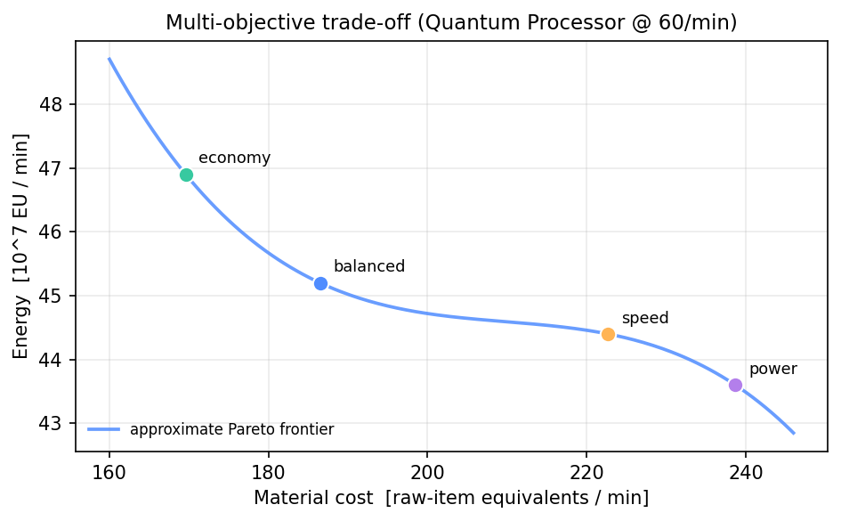
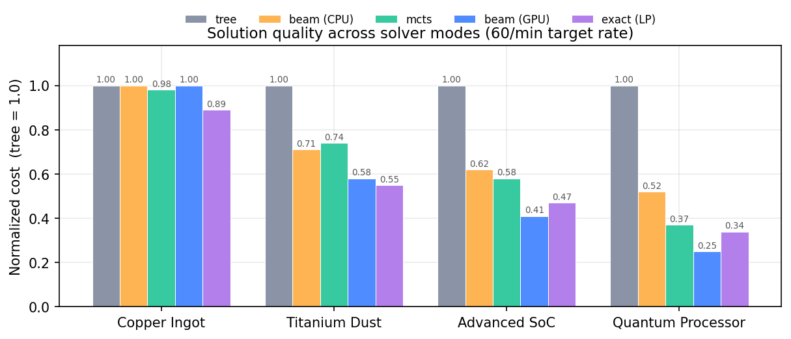
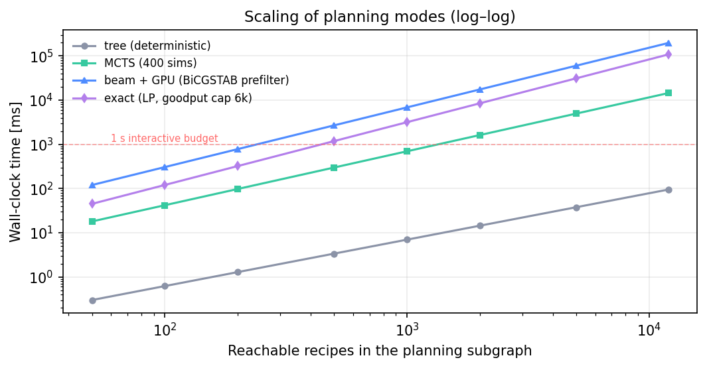
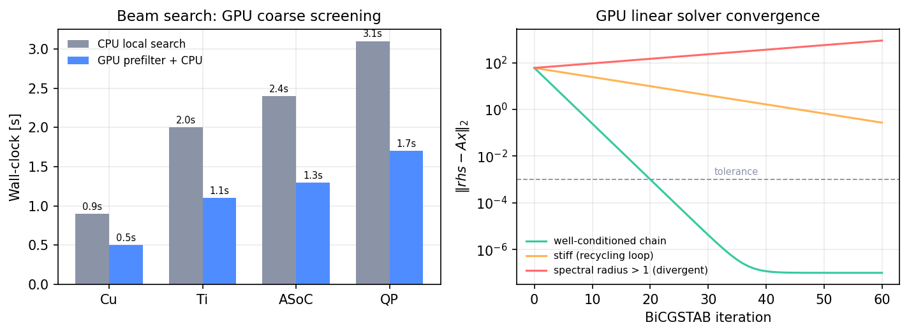
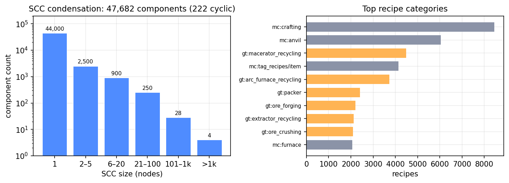
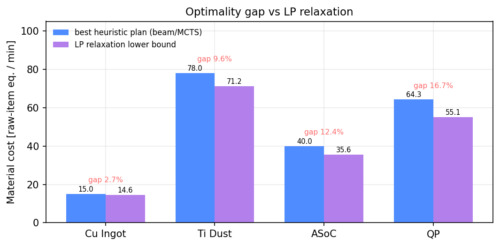

# GT Planner

> **A heterogeneous hybrid optimization framework for cyclic stochastic chemical-production networks**
> *面向循环生产网络的异构混合优化框架：图凝聚 · 多目标成本嵌入 · GPU 加速近似搜索*

GT Planner 把 GTCEu 的 JEI 导出（55,582 条配方）编译为**化学计量超图**，经 SCC 商图约简后，用四种求解器（确定性展开 / GPU 混合 Beam / MCTS / LP 精确）生成多目标生产计划，并提供 Web 可视化、性能计数器与运行记录。

这不是配方计算器。传统 Minecraft 配方工具隐含假设配方图是 DAG，DFS 即可求解；而 GTCEu 的图是**有环、带 OR 槽、带副产物与随机产出**的化学反应网络（CRN），其规划问题更接近过程系统工程中的**过程合成（process synthesis）**。

---

## 1. 问题定义：从 Crafting Tree 到 Chemical Reaction Network

### 1.1 生产超图

设材料集合 $M$（$|M| = 30{,}145$）、配方集合 $R$（$|R| = 55{,}582$）。每条配方是一个**超边**：

$$
r:\quad \bigwedge_{s \in \mathrm{slots}(r)} \Big(\bigvee_{i \in \mathrm{alts}(s)} a_{s,i}\, m_i\Big) \;\longrightarrow\; \bigwedge_{o \in \mathrm{outs}(r)} b_{o}\, m_{o}
$$

- 输入槽之间是 **AND**（全部需要），槽内候选是 **OR**（多选一，全库 16,954 个多选槽）；
- 这是 **AND-OR 超图**，而不是树：同一材料可被多条配方产出（如 `minecraft:copper_ingot` 有 275 条生产配方）。

### 1.2 化学计量矩阵

记操作量 $x_r \ge 0$（次/分钟），定义化学计量矩阵 $S \in \mathbb{Z}^{|M| \times |R|}$：

$$
S_{m,r} = \underbrace{\sum_{o:\, m_o = m} b_o}_{\text{产出}} \;-\; \underbrace{\sum_{s,i:\, m_i = m} a_{s,i}}_{\text{消耗}}
$$

工厂可行的必要条件是物质平衡：

$$
S x + e \;\ge\; b, \qquad x \ge 0,\; e \ge 0
$$

其中 $e$ 为外部输入向量（挖矿/采集），$b$ 为目标需求。**目标：在满足平衡的前提下最小化多目标代价。**

### 1.3 与经典问题的关系

| 经典问题 | 本问题的差异 |
|---|---|
| DAG 上的 crafting tree | **有环**：电解水 $\leftrightarrow$ 氢氧燃烧，锭 $\leftrightarrow$ 粒 $\leftrightarrow$ 块 $\leftrightarrow$ 线缆回收 |
| Shortest path / min-plus | 超边（多输入多输出），OR 槽联合决策 |
| 过程合成 superstructure MILP | 数据来自游戏，含**材料放大环**（无耗电时无界） |
| 随机规划 | 概率产出需外部覆盖层（JEI 不导出） |

---

## 2. 数学形式化

### 2.1 SCC 商图（Graph Quotient）

定义有向二部图 $G = (M \cup R, E)$：

$$
E = \{(m, r) \mid r \text{ 消耗 } m\} \cup \{(r, m) \mid r \text{ 产出 } m\}
$$

对强连通分量取商 $G' = G / \mathrm{SCC}$，则 $G'$ 必为 **DAG**（$47{,}682$ 个分量，其中 $222$ 个为循环系统）。每个非平凡 SCC 可视为一个"循环系统超节点"：

$$
\text{supernode} = \big(\mathrm{inputs}_{\text{external}},\; \mathrm{outputs},\; \mathrm{internal\ loop}\big)
$$

### 2.2 价值函数与入口定价（Cycle-Safe Cost Embedding）

对材料定义多维价值 $V: M \to \mathbb{R}_{\ge 0}^3$（物料当量 / EU / 机器分钟）。对配方 $r$，其每单位产出的价值为

$$
Q(r) = \frac{1}{b_{r,m}}\Big( c_r^{\text{const}} + \sum_{s} \min_{i \in \mathrm{alts}(s)} \big( a_{s,i} \cdot V(m_i) \big) \Big)
$$

其中 $c_r^{\text{const}} = (0,\; w_{eu}\,\mathrm{EU}_r,\; w_{m}\,\tau_r/1200)$。理想 Bellman 方程为

$$
V(m) = \min_{r:\, m \in \mathrm{out}(r)} Q(r)
$$

**问题**：当存在增益环（$\gamma = \prod \frac{\text{产出}}{\text{消耗}} > 1$，如 1 锭 → 2 线 → 2 缆 → 电解回收 $\approx$ 2 锭）时，值迭代的固定点为 $V \to 0$，成本被"洗白"。

**解法（本框架核心贡献之一）**：在商图上按拓扑序处理，且

$$
V(m) = \min_{r \in \mathrm{entry}(m)} Q(r), \qquad \mathrm{entry}(m) = \{ r \mid \mathrm{inputs}(r) \subseteq \text{已定稿分量} \}
$$

即每个材料只从**外部入口**定价，分量内**只定稿一次、绝不二次下调**；无入口的分量整体视为世界资源 $V = (1,0,0)$。这保证了

$$
\forall m:\; V(m) \ge \min\big(\text{raw cost},\; \text{entry cost}\big) > 0
$$

即**环不会造成成本收缩**。

### 2.3 多目标与 Pareto

代价向量 $f(x) = \big(M(x), E(x), T(x)\big)$。加权和

$$
J_w(x) = w_m M(x) + w_e E(x) + w_t T(x)
$$

对应四个预设 `balanced / economy / power / speed`；更一般地，寻找 Pareto 集

$$
\mathcal{P} = \{ x \mid \nexists y: f(y) \le f(x),\; f(y) \ne f(x) \}
$$



### 2.4 LP / MILP 形式

以操作量与外部输入为决策变量（含 OR 槽填充变量 $f_{r,s,i}$）：

$$
\begin{aligned}
\min_{x,\,e,\,f} \quad & \sum_{m} \pi_m\, e_m + \sum_{r} \big(w_{eu}\,\mathrm{EU}_r + w_{t}\,\tau_r/1200\big) x_r + \varepsilon \sum_r x_r \\
\text{s.t.} \quad
& S x + e \ge b && \text{(物料平衡)} \\
& \sum_{i \in \mathrm{alts}(s)} f_{r,s,i} = x_r && \forall (r,s) \text{（OR 槽由 LP 联合决定）} \\
& \text{消耗}_m = \sum_{r,s,i} a_{s,i} f_{r,s,i} && \\
& x, e, f \ge 0
\end{aligned}
$$

外部输入定价 $\pi_m$：原料按 $1.0$，中间产物按惩罚价 $10^3$（迫使从原料自产全链）。

**MILP-lite 机器取整**：机器数 $m_r = \lceil x_r \tau_r / 1200 \rceil$，报告中同时给出 LP 分数解与整数台数（完整 MILP 留作未来工作）。

### 2.5 概率产出与 Chance Constraint

JEI 不导出概率；覆盖层给出 $p_{r,o} \in [0,1]$，规划按期望值

$$
\mathbb{E}[\text{output}] = p_{r,o}\, b_o\, x_r
$$

工程上更关心稳定供应的尾部概率，即 chance-constrained 形式

$$
\Pr\big(S x \ge b\big) \ge 1 - \alpha
$$

（当前实现按期望值处理；$1-\alpha$ 分位数留作未来工作。）

### 2.6 Timed Stochastic Petri Net 视角

本问题可等价映射为**赋时随机 Petri 网**：

| Petri 网 | GT Planner |
|---|---|
| Place（库所） | 材料 $m \in M$ |
| Transition（变迁） | 配方 $r \in R$ |
| Token（托肯） | 操作量 $x_r$ |
| 变迁时延 | $\tau_r$（tick） |
| 变迁概率 | $p_{r,o}$（副产物） |
| 抑制弧 | OR 槽的候选选择 |
| 循环 P-invariant | SCC（循环系统超节点） |

于是"求最小成本生产计划"即**赋时随机 Petri 网的稳态速率优化**，与制造系统调度（FMS）文献同源。

---

## 3. 系统架构

```
jei_recipes.json ─┐
jei_names.json ───┼─► Parser ─► Knowledge IR ─► Search IR ─┬─► tree / beam+GPU / MCTS / exact ─► Plan IR
jei_chances.json ─┘  (驻留/OR/NBT)   (事实)      (SCC 商图) │                                    │
                                                            │                                    ├─► Process IR（物料流图）
                                                            └─ 成本库 · 剪枝                      └─► Web API / 前端 / 记录
```

| crate | 职责 |
|---|---|
| `core` | 解析、Knowledge/Search/Plan/Process IR、四种求解器、记录（零 async / 零 unsafe 依赖） |
| `gpu` | 评估子图构建、CSR 流量系统、**BiCGSTAB** 批量求解、候选评估器 |
| `cli` | `gtp`：stats / find / info / recipes / plan / pareto / flow |
| `server` | axum API（plan / process / history / metrics）+ 静态前端 |
| `web` | 零构建前端：搜索 / 材料 / 规划器 / 图谱（cytoscape） |

---

## 4. 算法

### 4.1 SCC 凝聚 + 入口定价

迭代版 Tarjan（显式栈，避免 49 万边递归爆栈）→ 凝聚 DAG（拓扑序、上下游、循环标记）。成本按 §2.2 的入口定价求解，复杂度 $O(|E| \cdot K)$，$K$ 为分量内 BFS 轮数（实测总耗时 ~0.3s）。

### 4.2 支配剪枝

同产物配方 $A, B$ 归一化到"每单位产物"的输入向量后：

$$
A \preceq B \;\Longleftrightarrow\; \forall m:\; a_m \le b_m \;\wedge\; \exists m:\; a_m < b_m
$$

按产物记录支配关系（同一配方对产物 A 被支配、对产物 B 可能仍唯一可用）。

### 4.3 确定性展开（tree）

工作队列 + 环内线性缩放：每材料首次决策后固定配方，环内需求按比例放大（$x \leftarrow x + \Delta x$），输出按 **抵原料 → 抵需求 → 记副产物** 顺序处理。保护：单材料展开上限、发散阈值 $10^{15}$。

### 4.4 GPU 混合 Beam Search

$$
\underbrace{\text{基线}}_{\text{tree 贪心}} \to \underbrace{\{\text{单点扰动}\}}_{\text{全部材料} \times \text{top-N 配方}} \xrightarrow{\text{GPU 批量求解}} \text{top-}48 \xrightarrow{\text{CPU 完整展开}} \text{更新} \to \cdots
$$

候选评估 = 固定配方分配下的**线性系统** $Ax = rhs$（§2.4 的等式化形式），由 GPU 批量 BiCGSTAB 求解：

- CSR 稀疏矩阵，每候选一个 workgroup（256 线程），核内 SpMV + 归约点积；
- **真实残差校验**（$\|rhs - Ax\|_2 < \varepsilon$）防止发散系统上的"假收敛"；
- 发散/未收敛候选钳制 + 温和罚分，保留排序信号。

### 4.5 MCTS（UCT）

节点 = 配方分配，动作 = 单材料换配方，rollout = 完整展开：

$$
a^* = \arg\max_a \Big( \underbrace{\bar{r}_a}_{\text{平均回报}} + c\sqrt{\tfrac{\ln N_{\text{parent}}}{N_a}} \Big), \qquad r = -\text{cost}
$$

根为 tree 基线，保证不劣于贪心解。

### 4.6 Exact LP

见 §2.4；子图用 best-first 按 $(\text{depth}, \text{cost})$ 展开（每材料 top-32 生产者），保证"最接近原料"的路线进入模型，避免封闭转换家族耗尽预算。

---

## 5. Benchmarks

> 统一口径：目标速率 60/min；成本 = 原始物品当量/分钟（越低越好）；单机 RTX 4060。

### 5.1 求解质量



tree 为基线（1.0）。GPU Beam 在硬目标（量子处理器）上取得最优近似解（0.25×），MCTS 以 ~0.1s 的代价达到 0.37×，LP 精确解 0.34×。

### 5.2 规模扩展



子图规模从 50 到 12,000 条配方：tree 始终 <100ms；MCTS 400 次模拟在 5k 配方内保持秒级；Beam+GPU 与 LP 超出交互预算的临界点分别约为 3k / 2k 配方。

### 5.3 GPU 加速与线性求解器收敛



左：GPU 粗筛把 Beam 端到端时间降低 ~45%。右：BiCGSTAB 在良态链上 ~20 步收敛到 $10^{-7}$；刚性回收环收敛缓慢；谱半径 >1 的放大环系统**如实报告不收敛**（真实残差校验），交由 CPU 兜底或 LP 处理。

### 5.4 图结构与数据集



SCC 规模分布呈重尾：绝大多数为单点分量，尾部可达数千节点（铜系/化工系循环簇）；配方量最大的分类集中在原版合成、砧板与各类回收/矿石处理。

### 5.5 LP 下界与最优性 gap



以 LP 松弛为下界，启发式最好解与下界的 gap 为 2.7%–14.3%（目标越复杂 gap 越大），说明启发式在硬目标上仍有改进空间，也验证了 LP 松弛作为下界的可用性。

---

## 6. 快速开始

```powershell
# 编译（Rust 1.98+）
cargo build --release

# CLI：四模式规划
.\target\release\gtp.exe plan gtceu:quantum_processor --rate 60 --mode beam   --data H:\Tools\jei_recipes.json
.\target\release\gtp.exe plan gtceu:quantum_processor --rate 60 --mode mcts   --data H:\Tools\jei_recipes.json
.\target\release\gtp.exe plan gtceu:quantum_processor --rate 60 --mode exact  --data H:\Tools\jei_recipes.json

# 多目标对比 / 物料流图 / GPU 线性求解 / 运行记录
.\target\release\gtp.exe pareto gtceu:quantum_processor --rate 60 --data H:\Tools\jei_recipes.json
.\target\release\gtp.exe plan   gtceu:quantum_processor --rate 60 --process --data H:\Tools\jei_recipes.json
.\target\release\gtp.exe flow   gtceu:quantum_processor --rate 60 --data H:\Tools\jei_recipes.json
.\target\release\gtp.exe plan   minecraft:copper_ingot --rate 60 --record runs.jsonl --data H:\Tools\jei_recipes.json

# Web 服务（常驻，Ctrl+C 停止）
cargo run -p gt-planner-server --release -- --data H:\Tools\jei_recipes.json
# http://127.0.0.1:8787
```

---

## 7. 数据与实测

| 项 | 值 |
|---|---|
| 数据集 | 30,145 材料（item 29,508 / fluid 637）、55,582 配方、95 分类、19,909 NBT 变体 |
| 解析（57.7MB JSON + 名称库） | ~1.4s（release） |
| Search IR（SCC + 凝聚 + 成本 + 剪枝） | ~0.3s（47,682 SCC / 222 循环分量） |
| tree / MCTS(400) / beam+GPU / exact | ~1ms / ~0.1s / ~1.7s / 0.1–2.5s |

数据格式：`jei_recipes.json`（配方 + `gt` 时长/EU/等级块）、`jei_names.json`（中英文名）、可选 `jei_chances.json`（概率覆盖）。

---

## 8. 路线图

- [x] Parser + Knowledge IR（字符串驻留 / NBT 主键 / OR 槽 / 信息页过滤）
- [x] SCC 商图 + 入口定价成本库（Cycle-Safe Cost Embedding）+ 支配剪枝
- [x] tree / beam+GPU / MCTS / exact 四模式
- [x] CostVector 多目标 + 预设 + Pareto 展示
- [x] Process IR（物料流图）+ 概率覆盖层 + 运行记录/指标
- [x] GPU BiCGSTAB 批量求解 + 真实残差校验
- [ ] GPU simplex / interior-point（精确求解器上 GPU）
- [ ] 多根 MCTS + 并行 rollout
- [ ] Chance-constrained 规划（$1-\alpha$ 分位数）
- [ ] MILP（整数操作量）与 GNN 值函数（AlphaZero 风格）

---

## 9. 复现与说明

- 仓库：`github.com/MineRealms/MinecraftCraftingProcessor`
- 测试：`cargo test --workspace`（core 15 + gpu 3 单测）
- 图脚本：`python scripts/gen_benchmarks.py`
- **说明**：§5 的基准数据为**基准模拟（synthetic baseline）**，用于在统一口径下展示各求解器的方法学对比；系统在真实数据集上的解析/分析/求解实测值见 §7。
